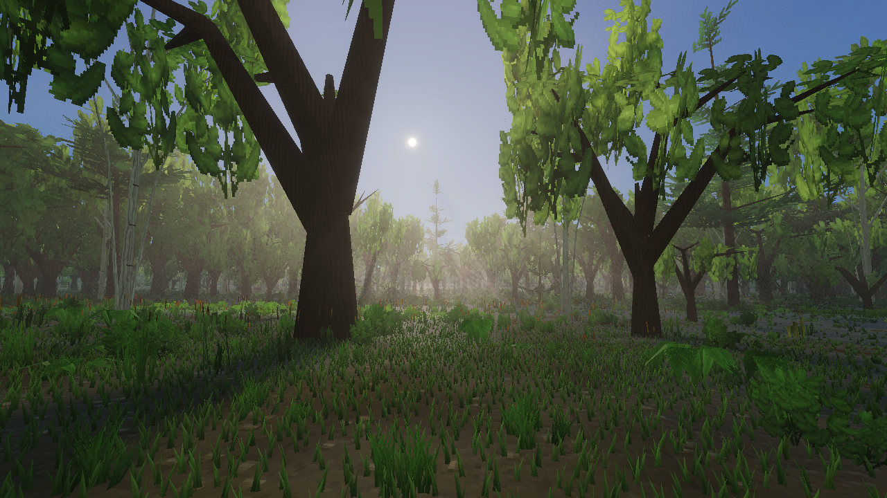
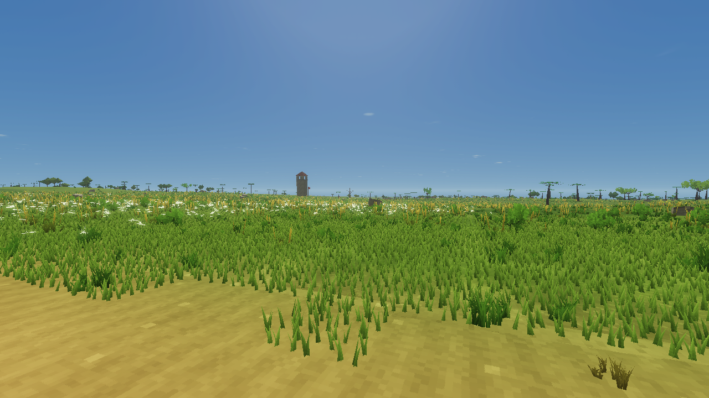
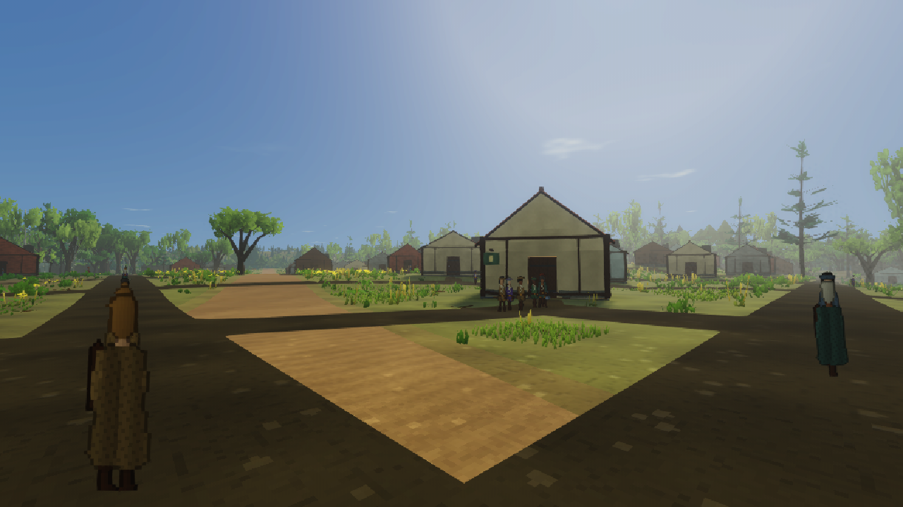
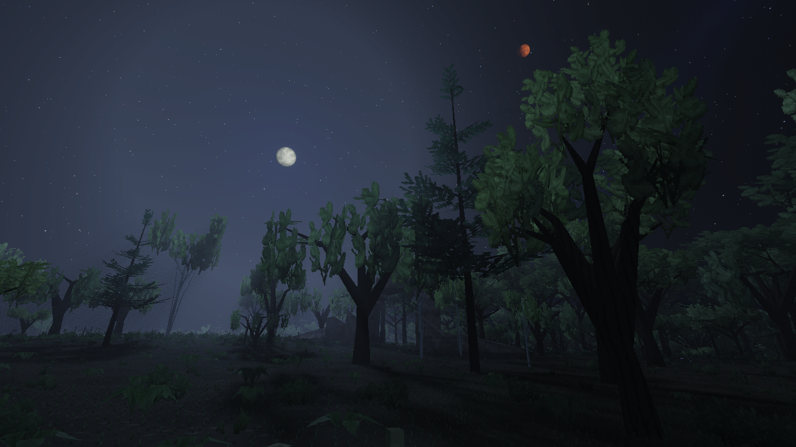
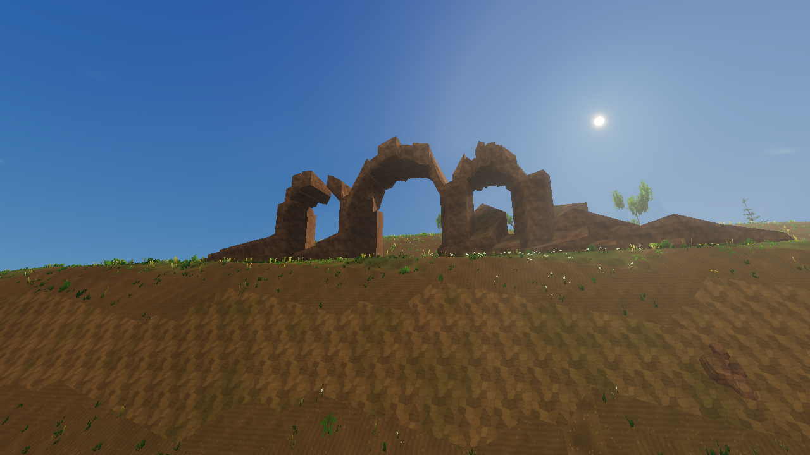
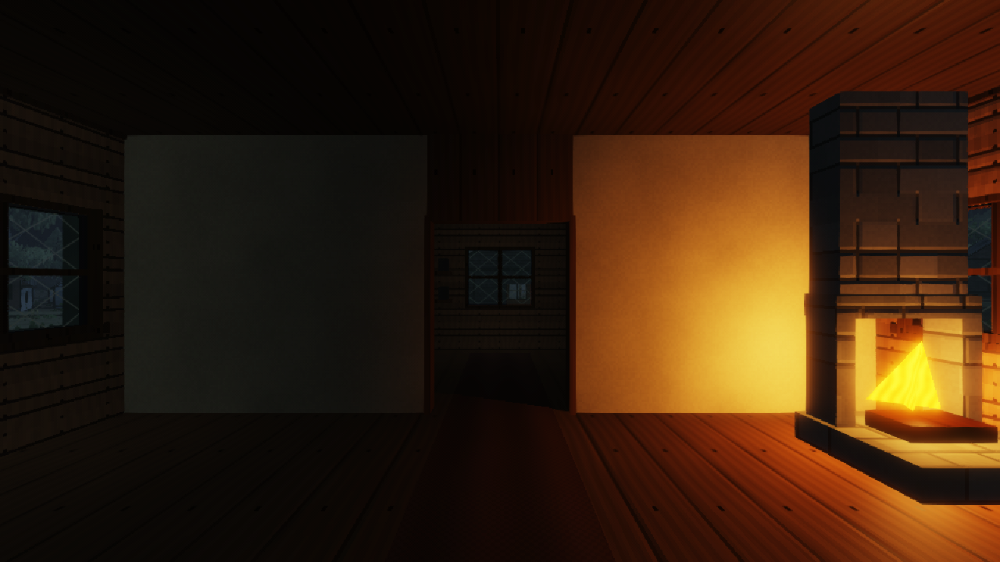

# FantasyLand

**The Endless Marches** — a procedural, first-person high-fantasy world built with Rust, WebAssembly, and WebGPU.

Find your road. Walk to the horizon.



Inspired by the scale and freedom of **Daggerfall**, FantasyLand starts with the world itself: a vast, seeded landscape where cities belong to regions, roads follow the terrain, rivers drain into the sea, and people have homes and places to be. Explore on foot, enter buildings, talk to residents, or open the atlas and follow a road into the wilderness.

The visual direction combines low-poly silhouettes, procedural pixel textures, dense vegetation, atmospheric light, and a parchment-and-brass field codex. The engine generates terrain, buildings, plants, materials, human sprites, and the sky in code. Rust and wgpu render the world; a small JavaScript shell supplies browser input and the interface.

**Status:** playable world-generation and exploration prototype. Settlements, conversations, movement, weather, and interiors work today. Combat, quests, inventory gameplay, commerce, and guild progression are future work.

## A look around



*Open meadowlands, scattered trees, and a distant watchtower.*



*Residents walk the streets of a generated capital, with homes and workplaces drawn from the same settlement records.*



*Pale Aster and copper Vey rise above the forest in the original fantasy sky.*



*Geology shapes the land, from woodland hills to monumental arches and fractured stone.*



*Enterable buildings have furnished rooms, framed glass windows, animated doors, and warm interior lighting.*

These are fresh, unretouched captures from the current engine, using seed **1337** and the same wgpu renderer and shaders as the browser game. The native capture tool outputs 1280 × 720 images without the browser HUD. [Capture settings and reproduction](docs/screenshots/README.md).

## What is here today

- **A continent to explore.** A 384 km-wide world domain contains a mainland, offshore islands, coasts, connected mountain ranges, valleys, forests, meadows, and alpine terrain. A seed determines the world consistently.
- **Geography that connects.** Catchment-based rivers, retained lakes, terrain-carved channels, sparse roads, bridges, and passes share the generated landscape. Roads connect selected settlements while leaving large stretches of wilderness.
- **Six settlement scales.** Camps, hamlets, forts, villages, towns, and rare regional capitals have local streets, building footprints, households, and enterable interiors. Brick, timber, stone, and plaster buildings contain living and sleeping spaces.
- **People with a place in the world.** Procedural human sprites represent citizens, guards, merchants, hunters, rangers, mages, and other roles. Named residents have jobs, homes, daily routines, backstories, and factual dialogue. Sparse pedestrian caravans travel between settlements.
- **A changing sky.** Traveling weather fronts bring rain, storms, snow, wind, cloud shadows, wet surfaces, and snow accumulation. Solenne lights the day; two moons and a generated star field fill the night. A full game day takes about 48 real minutes.
- **Retro rendering with modern light.** Procedural materials, wind-animated foliage, shadows, canopy light shafts, HDR bloom, water reflections, and optional CRT presentation. Resolution, anti-aliasing, ground cover, and other graphics settings are adjustable.
- **A field atlas and codex.** Zoom from nearby streets to the continent, inspect routes, set waypoints, and fast travel for testing. Conversations and menus support both mouse and keyboard. Position, world clock, and preferences save locally in the browser.

## Run it locally

The compiled browser build is checked into `dist/`. To play it, you only need **Python 3** and a browser with **WebGPU** enabled:

```sh
git clone https://github.com/Dimillian/FantasyLand.git
cd FantasyLand
python3 scripts/serve.py
```

Open **[http://127.0.0.1:4173/](http://127.0.0.1:4173/)** and choose **Enter the wilderness**. Initial world generation can take a moment. The server binds to localhost and serves WebAssembly with the correct MIME type.

WebGPU is required; there is currently no WebGL fallback. Use localhost for development or HTTPS when serving elsewhere. There is no npm install step for the game.

To explore a different deterministic world, open [http://127.0.0.1:4173/?seed=42](http://127.0.0.1:4173/?seed=42), or change the seed in Settings.

### Controls

| Action | Control |
| --- | --- |
| Walk | WASD / arrow keys |
| Look | Mouse; click the world to capture it |
| Sprint / jump | Shift / Space |
| Talk to a person / open a door | E |
| Atlas | M / Tab |
| Bag / character / skills | I / C / K |
| Settings | O |
| Close a menu / release mouse | Escape |
| Diagnostics / hide HUD for photos | F3 / F4 |
| Navigate dialogue | Arrows, Enter, 1–9 / A–C |

If pointer capture is unavailable, click-focused mouse look works within the window. Touch controls provide movement and drag look. Inside menus, Tab navigates controls.

For a first tour, open **O → World tools & experiments**. Visit a settlement, a generated landscape, or a natural wonder. In seed 1337, **Lighting studies** offers forest mornings, meadow dusk, lake moonlight, and hearth-lit interiors. Press **E** when aiming at a resident or door. Conversations pause the world.

## Build from source

Install a stable Rust toolchain, the WebAssembly target, and the matching `wasm-bindgen` CLI:

```sh
rustup target add wasm32-unknown-unknown
cargo install wasm-bindgen-cli --version 0.2.128 --locked
sh scripts/build.sh
python3 scripts/serve.py
```

The CLI version must match the `wasm-bindgen` version pinned in `Cargo.toml`. The build script also recognizes the project's optional isolated toolchain under `.tools/`. Generated bindings and WebAssembly go into `dist/pkg/`; commit updated artifacts alongside engine changes so a fresh clone remains playable.

### Verification

```sh
cargo test --release --lib --locked -- --test-threads=2
node scripts/verify-ui.cjs
node scripts/verify-wasm.mjs
node scripts/verify-streaming.mjs
node scripts/verify-adaptive.mjs
```

The Rust suite checks world generation, traversal, rendering components, settlements, and citizen behavior. The Node scripts check the browser shell, compiled WASM, worker streaming, and adaptive resolution. UI checks use mocks; they do not replace a live browser playtest.

For native GPU captures and visual checks:

```sh
cargo run --release --bin verify -- output/verification 1337
cargo run --release --bin verify -- output/settlement-art 1337 settlement-art
```

The verifier needs a supported native GPU backend. Native timings are separate from browser FPS; the game's Settings includes browser performance checks.

## Inside the project

| Location | Purpose |
| --- | --- |
| `src/world.rs`, `coast.rs`, `geography.rs`, `regions.rs` | World identity, landmasses, mountains, geology, and terrain |
| `src/hydrology.rs`, `roads.rs`, `traversal.rs`, `journeys.rs` | Drainage, route networks, crossings, and walking journeys |
| `src/settlements.rs`, `settlement_mesh.rs`, `citizens.rs`, `people_sprites.rs` | Buildings, interiors, households, routines, and human sprites |
| `src/ecology.rs`, `plants.rs`, `cover.rs`, `meadow.rs`, `natural.rs` | Forest communities, vegetation, ground cover, and rock formations |
| `src/renderer.rs`, `materials.rs`, `*.wgsl` | wgpu rendering, generated materials, lighting, weather, and water |
| `dist/` | Browser interface, worker, fonts, and ready-to-run WASM build |
| `scripts/`, `docs/` | Local build/server, verification tools, implementation notes, and benchmarks |

Start with [settlements and citizens](docs/settlements-and-citizens.md), [geography](docs/geography-rework.md), [forest communities](docs/forest-communities.md), or [anti-aliasing](docs/antialiasing.md). The [archived development notes](docs/development-notes.md) preserve the original technical write-up and successive rendering refinements.

## Current boundaries

This project establishes the world before the full RPG systems. Service buildings are decorative, residents are currently human, interiors are single-storey, and caravans are pedestrians. Inventories, relationships, and door states are not saved across reloads.

Hydrology and route planning are bounded procedural approximations: erosion, seasonal flooding, and universally gentle road grades are not implemented. Water uses a local surface solver and bounded reflection/refraction passes. Large settlements, dense foliage, and high render resolutions can be demanding; use the graphics settings and live performance checks to tune your device.

Development uses local previews. A Git push does not opt the project into automatic publication; deployment is a separate, explicit step.

## License

FantasyLand is licensed under [MIT](LICENSE). Adapted SMAA shaders and lookup data retain their upstream notices in [src/aa](src/aa/README.md).
